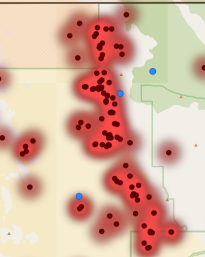
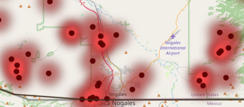
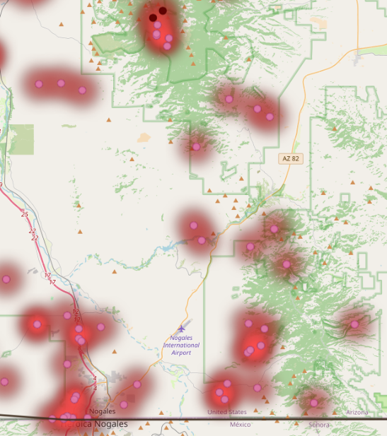

<html lang="en">
<head>
	<meta charset="UTF-8">
	<meta name="viewport" content="width=device-width, initial-scale=1.0">
	<title>Aqua Vitalis: Providing Drinking Water in the Southern Arizona Desert</title>
	
</head>
<body>
	<header>
		<nav>
			
Aqua Vitalis: Providing Drinking Water in the Southern Arizona Desert

		</nav>
	</header>

	<main>
		<section class="hero about-map-box" aria-label="About and interactive map section">
			<h2>About this Map</h2>
			

				This map has been designed as a tool to help the organization 
				Humane Borders visualize and optimize the deployment of drinking water stations
				in the counties of Yuma, Pima, and Santa Cruz in southern Arizona.
			

			

				Use the layer feature to toggle on and off locations of water stations and 
				deaths of individuals over the past five years. Use the time slider to see locations
				for deaths at monthly intervals.You can also enable the distance tool to
				see how far each death occurred from a water station.
			

		</section>

		<section class="map-panel" id="map-section">
			<iframe
				class="map-embed"
				src="Project.html"
				title="Southern Arizona water station map"
				allow="fullscreen"
				allowfullscreen
				loading="eager">
			</iframe>
			

				Leaflet-style UI
				Map design and layers created using Leaflet and ArcGIS Online.
			

		</section>

		<section class="weather-section" id="weather-section" aria-label="Real-time weather in southern Arizona">
			

				

					<h2>Real-Time Weather</h2>
					
Current conditions for southern Arizona locations near the water station network.

				

				

					
Loading current conditions...

					<button class="weather-refresh" id="refreshWeatherButton" type="button">Refresh Weather</button>
				

			

			

				
Weather data is loading.

			

		</section>

		

			<section id="about-section">
				<h2>Preliminary Analysis</h2>
				

					The harsh conditions of the Sonoran Desert make travel on foot a life-threatening prospect.
					People cross the international border at many points, and take many routes. However, the data indicate
					some areas as "hot spots" for deaths. Deployment of new or existing water stations to these
					areas may make a positive impact.
				

				

					
					

						
						
Clusters of deaths more than 10 miles from a station (indicated in pink) also suggest that a water station in this area could be beneficial.

						
					

				

			</section>

			<section>
				<h2>Sobering Facts</h2>
				

					
				

				

					

						
Deaths since 2021

						
Loading...

					

					

						
Average age of the deceased

						
Loading...

					

					

						
Average distance from deceased to nearest water station (miles)

						
Loading...

					

				

				

					
Deaths by Month of Year

					

						<canvas id="deathsByMonthChart" aria-label="Pie chart of deaths by month of year"></canvas>
					

				

			</section>
		

		<section id="video-section">
			<h2>About Humane Borders' Mission</h2>
			
Featured YouTube video.

			

				<iframe
					src="https://www.youtube.com/embed/wXiyJBaN0Qk"
					title="YouTube video"
					allow="accelerometer; autoplay; clipboard-write; encrypted-media; gyroscope; picture-in-picture"
					allowfullscreen>
				</iframe>
			

			

				If the video does not load here, watch it on
				<a href="https://www.youtube.com/watch?v=wXiyJBaN0Qk" target="_blank" rel="noopener noreferrer">YouTube</a>.
			

		</section>
	</main>

	<footer>
		
	</footer>

	
	
	
	
</body>
</html>
